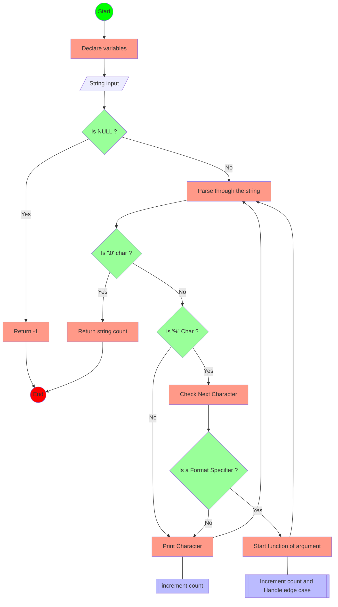

# _printf

[](https://forthebadge.com) [](https://forthebadge.com)

## Description

This is a a custom version of the printf fuction, which have the most basic functionalities such as printing a string, a character and also printing an integer number.

## Requirement

- Ubuntu 20.04.06 LTS

- include header file ```"main.h"```

- compilation line : ```gcc -Wall -Werror -Wextra -pedantic *.c```

- ```gcc version 9.4.0 (Ubuntu 9.4.0-1ubuntu1~20.04.1)```

## How it's working
- Using a composite data type such as struct which will contain the declaration of a char pointer *specifier and a pointer to a function called *print, this will be receiving a type val_list which will be the list of arguments from format, that will be printed in case there is a match between the struct first argument (specifier) and the format.



## Exemple

#### main file
```c
#include  "main.h"

int  main(void)
{
    _printf("Hello, World!");

return (0);

}
```

#### output

```sh
Hello,  World
```

## How to download it

- You can go on the repository in Github and click on the green button and copy the link or download the zip :


Or you can use this commandline directly in your terminal:

```Bash
git  clone  https://github.com/letihab/holbertonschool-printf.git
```

## How to start

- To compile the code, and execute it, enter this command line :

```Bash
gcc  -Wall  -Werror  -Wextra  -pedantic  *.c
```

## How to try it
This is a main you can use to tested out the _ptrintf function

```C
#include  <limits.h>
#include  <stdio.h>
#include  "main.h"
/**
* main - Entry point
*
* Return: Always 0
*/
int  main(void)
{
    int len;
    int len2;
    unsigned  int ui;
    void  *addr;

    len =  _printf("Let's try to printf a simple sentence.\n");
    len2 =  printf("Let's try to printf a simple sentence.\n");
    ui = (unsigned  int)INT_MAX +  1024;
    _printf("Length:[%d, %i]\n", len, len);
    printf("Length:[%d, %i]\n", len2, len2);
    _printf("Negative:[%d]\n", -762534);
    printf("Negative:[%d]\n", -762534);
    _printf("Character:[%c]\n", 'H');
    printf("Character:[%c]\n", 'H');
    _printf("String:[%s]\n", "I am a string !");
    printf("String:[%s]\n", "I am a string !");
    len =  _printf("Percent:[%%]\n");
    len2 =  printf("Percent:[%%]\n");
    _printf("Len:[%d]\n", len);
    printf("Len:[%d]\n", len2);
    _printf("Unknown:[%r]\n");
    printf("Unknown:[%r]\n");

    return (0);
}
```
compile and run the executable

```Bash
user@ubuntu:~/holbertonschool-printf/printf$  gcc  -Wall  -Wextra  -Werror  -pedantic  -Wno-format  *.c
user@ubuntu:~/holbertonschool-printf/printf$  ./printf
Let's try to printf a simple sentence.
Let's  try  to  printf  a  simple  sentence.
Length:[39,  39]
Length:[39,  39]
Negative:[-762534]
Negative:[-762534]
Character:[H]
Character:[H]
String:[I  am  a  string  !]
String:[I  am  a  string  !]
Percent:[%]
Percent:[%]
Len:[12]
Len:[12]
Unknown:[%r]
Unknown:[%r]
user@ubuntu:~/holbertonschool-printf/printf$
```

You can open a man page and get more information about it.

```Bash
user@ubuntu:~/holbertonschool-printf/printf$  **man  ./man_3_printf**
```

## Versions
This is the lastest version of our printf

**Dernière version stable :** (https://github.com/letihab/holbertonschool-printf/tree/master)

## Authors

*  **Habib Leticia**  _alias_ [@letihab](https://github.com/letihab)
*  **Pellissard Kevin**  _alias_ [@PellissardKevin](https://github.com/PellissardKevin)

## License

This project is licensed under ``MIT license`` - see the [LICENSE.md](LICENSE.md) for more details.
